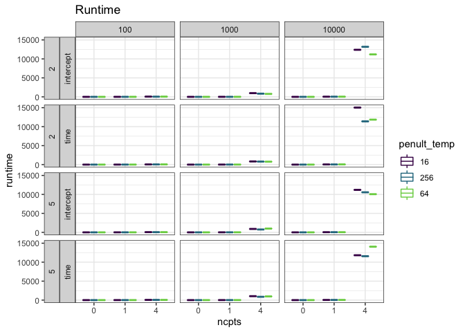
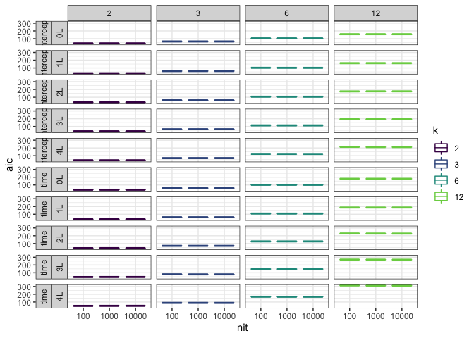
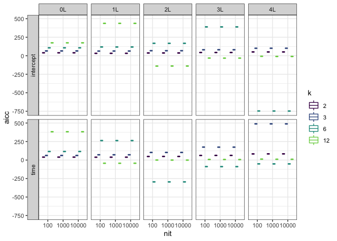

TS model diagnostics
================

Summary report of various diagnostics for LDATS time series models run with model configurations.

The current diagnostics are:

-   Runtime (in seconds)
-   AIC as reported in the `TS_on_LDA` object from LDATS; `ts_model$AIC`
-   AICc as calculated by `LDATS::AICc`; `LDATS::AICc(ts_model)`
-   Trace plots of parameter estimates over time. These parameters are:
-   Etas: Estimates of the intercept & covariate coefficients (if applicable) for the TS fit. For a model with `n` changepoints and `k` topics, there will be `(n + 1) * (k - 1)` etas.
-   Rhos: Estimates of the changepoint locations (if applicable). There is one rho for every changepoint in a model.

The current model configurations are all combinations of: \* LDA seed = 1977 \* 2 or 12 topics \* 0, 1, or 4 changepoints \* Formulas `~ 1` or `~ time`

I have not plotted all the etas because there are a lot of them for the more complex models.

### Runtime of TS models (in seconds)

The y-axis is runtime; colors are the number of topics; the x axis is the number of iterations. The facets are the number of changepoints (columns) and the formula (rows).

More changepoints takes longer, and of course more iterations takes longer. The models speed up as the number of iterations increases (that is, 100000 iterations does not take 10x as long as 10000 iterations). Interestingly more topics does not necessarily take longer?

AIC and AICc of TS models
-------------------------

    ## # A tibble: 10 x 6
    ##    k     ncpts cov       nit    aicc   aic
    ##    <fct> <fct> <fct>     <fct> <dbl> <dbl>
    ##  1 2     0     intercept 100    39.8  39.6
    ##  2 2     0     intercept 10000  39.8  39.6
    ##  3 2     0     intercept 1e.05  39.8  39.6
    ##  4 2     0     time      100    39.4  39.0
    ##  5 2     0     time      10000  39.4  39.0
    ##  6 2     0     time      1e.05  39.4  39.0
    ##  7 12    0     intercept 100   174.  158. 
    ##  8 12    0     intercept 10000 174.  158. 
    ##  9 12    0     intercept 1e.05 174.  158. 
    ## 10 12    0     time      100   382.  180.

AIC and AICc values appear not to change over number of iterations.

Parameter estimates over iterations
-----------------------------------

### Etas (coefficients within segments)

I have plotted etas for models with 2 topics, 0 or 1 changepoint, and `~1` or `~time`. Other configurations are possible but can be very large, because there are new etas for every additional topic-segment combination. I'm hoping the 100000 iteration plots will be visible at high resolution.

The facet strips are: number of changepoints; formula; parameter being estimated.

#### Etas 100 iterations

#### Etas 10,000 iterations

#### Etas 100,000 iterations

### Rhos (changepoint locations)

I have plotted rhos for models with 2 topics, 1 or 4 changepoints, and `~1` or `~time`. The facet strips are number of changepoints; formula. The colors are the different changepoints being estimated.

#### Rhos 100 iterations

#### Rhos 10,000 iterations

#### Rhos 100,000 iterations

