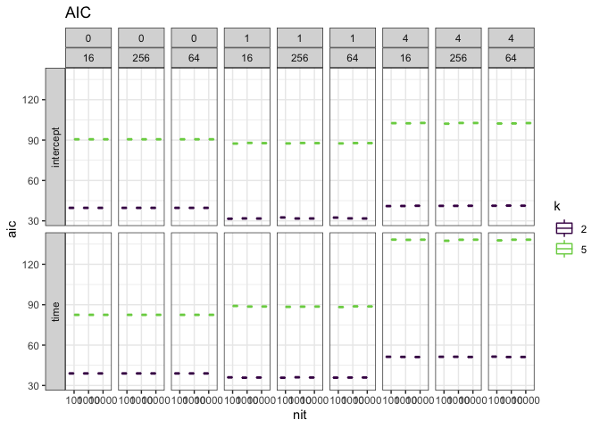

TS model diagnostics
================

``` r
loadd(all_models, cache = cache)

model_names <- lapply(as.list(names(all_models)), 
                      FUN = function(model_result_name)
                        return(strsplit(model_result_name, "_")[[1]]))

names(model_names) = 1:length(model_names)
model_names <- bind_rows(model_names) %>%
  t()

model_names <- as.data.frame(model_names) %>%
  select(-V1) %>%
  rename(seed = V2,
         k = V3,
         ncpts = V4,
         cov = V5,
         nit = V6) %>%
  mutate(k = factor(k),
         ncpts = as.factor(ncpts),
         obj_index = row_number(),
         full_name = names(all_models)) %>%
  mutate(k = factor(k, levels = as.character(sort(as.numeric(levels(k))))))
```

### Runtime of TS models (in seconds)

``` r
runtime <- data.frame(
  full_name = names(all_models),
  runtime = vapply(all_models,
                   FUN = function(model_result)
                     return(model_result$timing$toc["elapsed"] -
                              model_result$timing$tic["elapsed"]),
                   FUN.VALUE = 8),
  row.names = NULL, stringsAsFactors = F)

model_info <- left_join(model_names, runtime, by = "full_name")


runtime_plot <- ggplot(data = model_info, aes(x = nit, y = runtime, color = k)) +
  geom_boxplot() +
  facet_grid(rows = vars(cov), cols = vars(ncpts), switch = "y") +
  theme_bw() +
  scale_color_viridis_d(end = .8)
runtime_plot
```


AICc of TS models
-----------------

``` r
aiccs <- data.frame(
  aicc = vapply(all_models,
                FUN = function(ts_result)
                  return(LDATS::AICc(ts_result$ts[[1]])),
                FUN.VALUE = 30),
  aic = vapply(all_models,
               FUN = function(ts_result)
                 return(ts_result$ts[[1]]$AIC),
               FUN.VALUE = 30),
  full_name = names(all_models),
  row.names = NULL, stringsAsFactors = F)

model_info <- left_join(model_info, aiccs, by = "full_name")

aic_plot <- ggplot(data = model_info, aes(x = nit, y = aic, color = k)) +
  geom_boxplot() +
  facet_grid(rows = vars(cov), cols = vars(ncpts), switch = "y") +
  theme_bw() +
  scale_color_viridis_d(end = .8)

aic_plot
```



Why do matching models have the same AIC? They have different formulas and different projections:

``` r
loadd(models_1977_2_0L_time_100, cache = cache)
loadd(models_1977_2_0L_intercept_100, cache = cache)

models_1977_2_0L_time_100$ts[[1]]$formula
```

    ## gamma ~ year
    ## <environment: 0x7f9526ccebb0>

``` r
models_1977_2_0L_intercept_100$ts[[1]]$formula
```

    ## gamma ~ 1
    ## <environment: 0x7f952d466aa8>

``` r
plot(models_1977_2_0L_time_100$ts[[1]])
```


``` r
plot(models_1977_2_0L_intercept_100$ts[[1]])
```


``` r
loadd(models_1977_2_1L_time_100, cache = cache)
loadd(models_1977_2_1L_intercept_100, cache = cache)

models_1977_2_1L_time_100$ts[[1]]$formula
```

    ## gamma ~ year
    ## <environment: 0x7f953020fde8>

``` r
models_1977_2_1L_intercept_100$ts[[1]]$formula
```

    ## gamma ~ 1
    ## <environment: 0x7f952a8d5f10>

``` r
plot(models_1977_2_1L_time_100$ts[[1]])
```


``` r
plot(models_1977_2_1L_intercept_100$ts[[1]])
```


Interestingly, AICc matches across nb iterations but does change for model configurations. My current guess is that this is so few iterations, 1000 vs. 100 doesn't give substantially different fits. More iterations might start to show changes - stay tuned for 10k from the hipergator.

``` r
aicc_plot <- ggplot(data = model_info, aes(x = nit, y = aicc, color = k)) +
  geom_boxplot() +
  facet_grid(rows = vars(cov), cols = vars(ncpts), switch = "y") +
  theme_bw() +
  scale_color_viridis_d(end = .8)

aicc_plot
```


Parameter estimates over iterations
-----------------------------------

### Etas (coefficients within segments)

``` r
get_etas <- function(ts_result) {
  etas_df <- ts_result$ts[[1]]$etas %>%
    as.data.frame() %>%
    mutate(draw = row_number())
  
  return(etas_df)
}

etas <- lapply(all_models, FUN = get_etas)

etas <- bind_rows(etas, .id = "full_name") %>%
  tidyr::gather(-draw, -full_name, key = "parameter", value = "estimate") %>%
  filter(!is.na(estimate))

etas_info <- left_join(etas, model_info, by = "full_name") %>%
  filter(k %in% c(2,3),
         as.character(ncpts) %in% c("0L", "1L"))


etas_plot <- ggplot(data = etas_info, aes(x = draw, y = estimate, color = k)) +
  geom_line() +
  theme_bw() +
  facet_grid(rows = vars(ncpts, cov, k, parameter), cols = vars(nit), scales = "free", switch = "y", drop = TRUE) +
  scale_color_viridis_d(end = .8)
etas_plot
```


