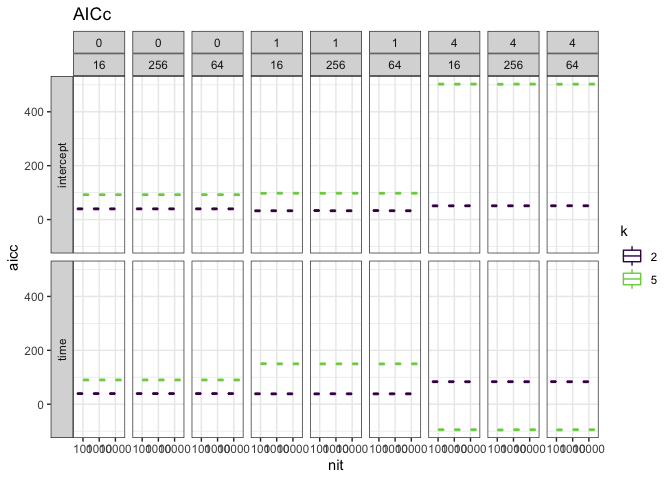

TS model diagnostics
================

Summary report of various diagnostics for LDATS time series models run with model configurations.

The current diagnostics are:

-   Runtime (in seconds)
-   AIC as reported in the `TS_on_LDA` object from LDATS; `ts_model$AIC`
-   AICc as calculated by `LDATS::AICc`; `LDATS::AICc(ts_model)`
-   Trace plots of parameter estimates over time. These parameters are:
-   Etas: Estimates of the intercept & covariate coefficients (if applicable) for the TS fit. For a model with `n` changepoints and `k` topics, there will be `(n + 1) * (k - 1)` etas.
-   Rhos: Estimates of the changepoint locations (if applicable). There is one rho for every changepoint in a model.

The current model configurations are all combinations of: 

-   LDA seed = 1977
-   2 or 5 topics
-   0, 1, or 4 changepoints 
-   Formulas `~ 1` or `~ time` 
-   100, 1000, or 10000 iterations 
-   `penultimate_temp` = 2^4, 2^6, 2^8 (`LDATS` default is 2^6)

I have not plotted all the etas because there are a lot of them for the more complex models.

### Runtime of TS models (in seconds)

The y-axis is runtime. The x axis is number of changepoints. The facet columns are the penultimate temperature, and the facet rows are covariate nested within number of topics.

More changepoints takes longer, and of course more iterations takes longer. Up to 10000 iterations there isn't an obvious improvement in speed as the iterations continue, but the runs I did previously with 100000 iterations did speed up. So 10000 seems to take v roughly 10x as long as 1000, but 100000 does not take 10x as long as 10000. The number of topics, penultimate temperature, and covariate don't impact runtime nearly as much as nit and ncpts.

AIC and AICc of TS models
-------------------------

The x axis is the number of iterations, and the y axis is the AIC (ts_model$AIC). Green is 5 topics and purple is 2 topics. The facet rows are ~intercept on top and ~time on the bottom. The facet columns are penultimate temperature nested within number of changepoints (0, 1, 4). 

AIC and AICc do not change, out to 7 figures, over iterations or temperature for 0 changepoint models. For models with changepoints, AIC and AICc change numerically but negligably (&lt;2 units) over different numbers of iterations/temperatures. 

2 topics has consistently lower AIC than 5 topics, except for 4 changepoints and ~time.

    ## # A tibble: 10 x 7
    ##    k     ncpts cov       nit   penult_temp  aicc   aic
    ##    <fct> <fct> <fct>     <fct> <fct>       <dbl> <dbl>
    ##  1 2     0     intercept 100   16           39.8  39.6
    ##  2 2     0     intercept 1000  16           39.8  39.6
    ##  3 2     0     intercept 10000 16           39.8  39.6
    ##  4 2     0     intercept 100   256          39.8  39.6
    ##  5 2     0     intercept 1000  256          39.8  39.6
    ##  6 2     0     intercept 10000 256          39.8  39.6
    ##  7 2     0     intercept 100   64           39.8  39.6
    ##  8 2     0     intercept 1000  64           39.8  39.6
    ##  9 2     0     intercept 10000 64           39.8  39.6
    ## 10 2     0     time      100   16           39.4  39.0

    ## # A tibble: 11 x 7
    ##    k     ncpts cov       nit   penult_temp  aicc   aic
    ##    <fct> <fct> <fct>     <fct> <fct>       <dbl> <dbl>
    ##  1 2     1     intercept 100   16           32.6  31.6
    ##  2 2     1     intercept 1000  16           32.8  31.8
    ##  3 2     1     intercept 10000 16           32.7  31.7
    ##  4 2     1     intercept 100   256          33.5  32.5
    ##  5 2     1     intercept 1000  256          32.7  31.7
    ##  6 2     1     intercept 10000 256          32.8  31.8
    ##  7 2     1     intercept 100   64           33.4  32.4
    ##  8 2     1     intercept 1000  64           32.8  31.8
    ##  9 2     1     intercept 10000 64           32.7  31.7
    ## 10 2     1     time      100   16           38.8  36.0
    ## 11 2     1     time      1000  16           38.5  35.8
    

Parameter estimates over iterations
-----------------------------------

I am not completely sure how to interpret these plots. The strangest thing to me is that the (mean) estimates don't appear to change much over even a large number of iterations. That is consistent with AIC and AICc not changing, but I am not sure how to interpret it.

### Etas (coefficients within segments)

I have plotted etas for models with 2 topics, 0 or 1 changepoint, and `~1` or `~time`. Other configurations are possible but can be very large, because there are new etas for every additional topic-segment combination. I'm hoping the 10000 iteration plots will be visible at high resolution.

The facet strips are: number of changepoints; formula; temperature; parameter being estimated.

#### Etas 100 iterations

#### Etas 1000 iterations

#### Etas 100,000 iterations

### Rhos (changepoint locations)

I have plotted rhos for models with 2 topics, 1 or 4 changepoints, and `~1` or `~time`. The facet strips are number of changepoints; temperature; formula. The colors are the different changepoints being estimated.

#### Rhos 100 iterations

#### Rhos 1000 iterations

#### Rhos 10,000 iterations

